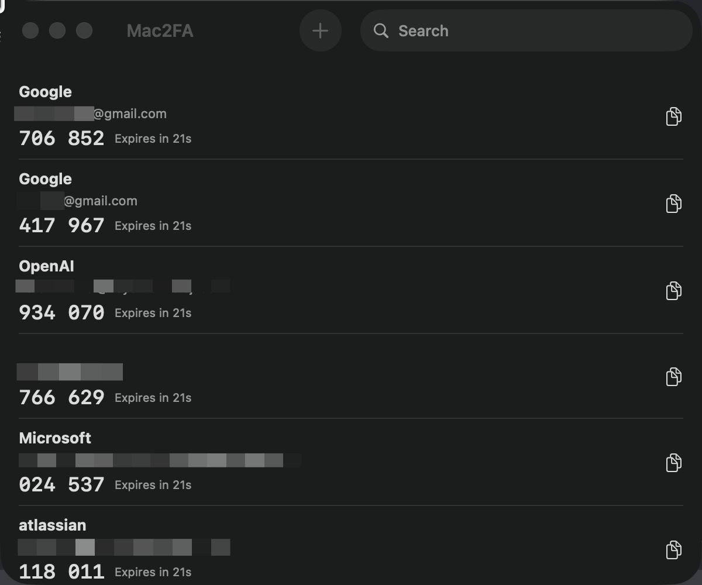
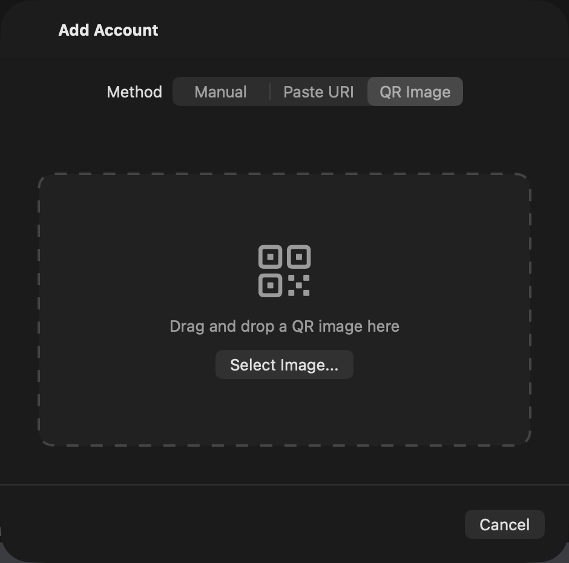
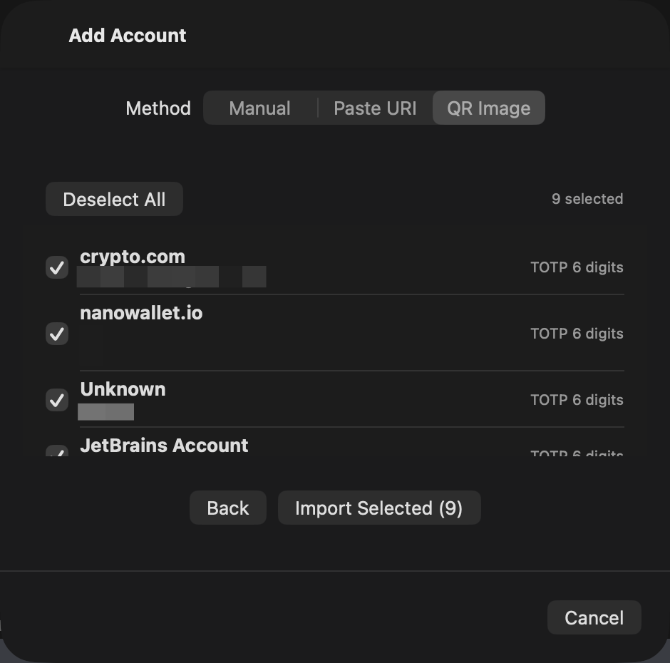
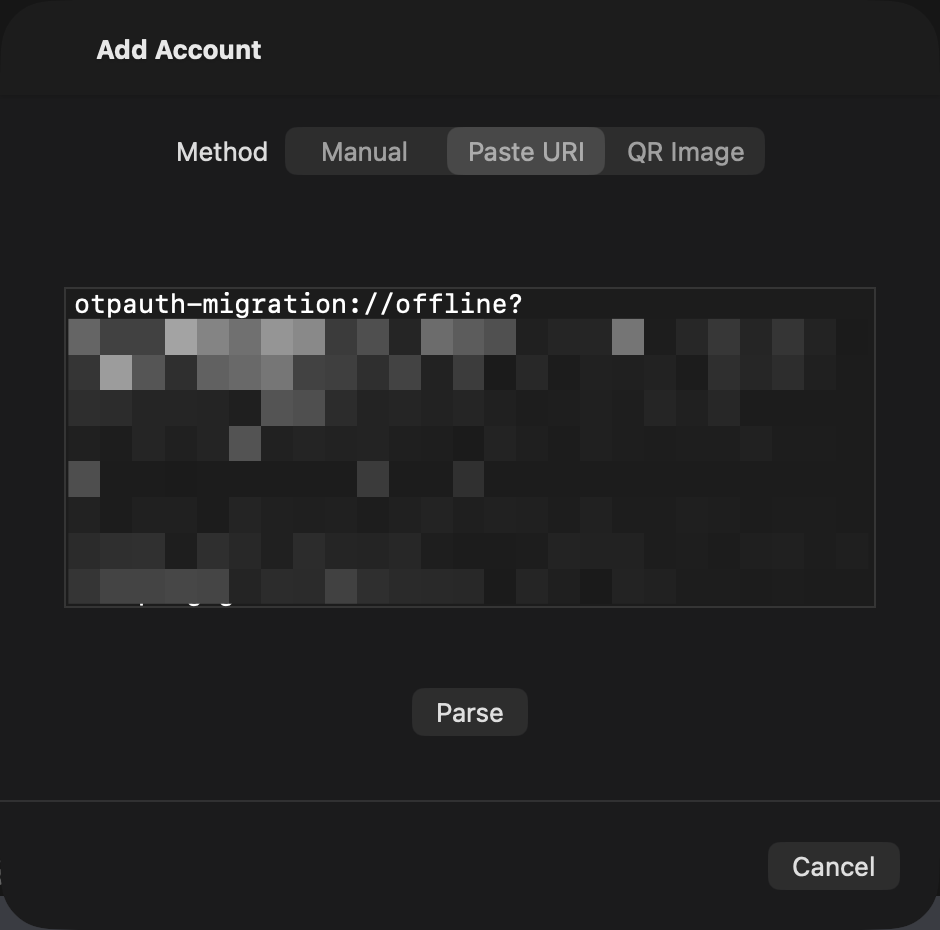
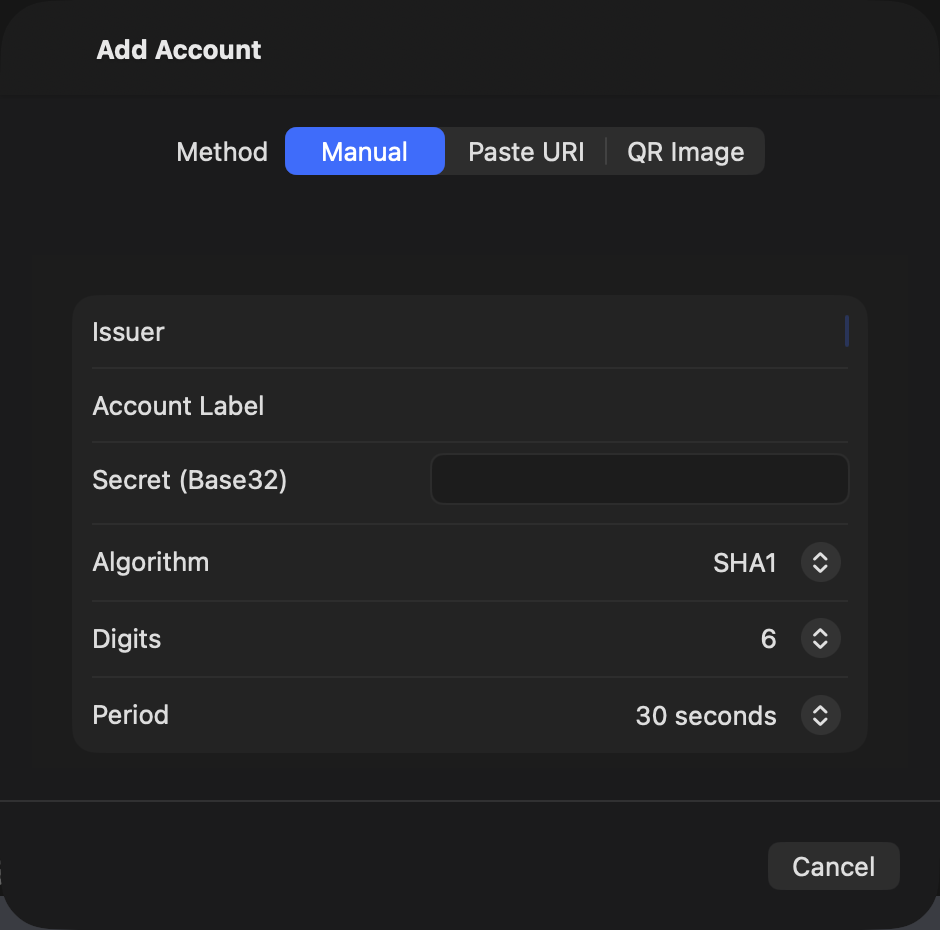

# Mac2FA

Mac2FA is a lightweight macOS two-factor authentication app for generating TOTP codes locally. It supports Google Authenticator imports, standard `otpauth://` TOTP accounts, and local secret storage through the macOS Keychain.

## Screenshots

<p>
  
</p>

<p>
  
  
</p>

<p>
  
  
</p>

## Features

- Generate TOTP codes for saved accounts.
- Copy codes by clicking an account row or the copy button.
- Search accounts by issuer or account label.
- Add accounts manually with Base32 secrets.
- Import standard `otpauth://` TOTP URIs by pasting them.
- Import Google Authenticator migration links and QR codes.
- Import OTP QR codes from image files or drag-and-drop.
- Delete accounts from the list or context menu.
- Check GitHub releases for app updates.

## Requirements

- macOS 14.0 or later
- Xcode with Swift 6 support
- XcodeGen, only if you want to regenerate `Mac2FA.xcodeproj` from `project.yml`

## Project Structure

- `Mac2FA/App`: app entry point
- `Mac2FA/UI`: SwiftUI screens and account list rows
- `Mac2FA/OTP`: Base32, HOTP, TOTP, OTP Auth URI, and Google migration parsing
- `Mac2FA/Storage`: account persistence and Keychain integration
- `Mac2FA/Update`: GitHub release update checking
- `Mac2FATests`: unit tests for OTP parsing and generation helpers
- `project.yml`: XcodeGen project definition

## Build and Run

Open the existing Xcode project:

```sh
open Mac2FA.xcodeproj
```

Then select the `Mac2FA` scheme and run the app.

If you change `project.yml`, regenerate the Xcode project with XcodeGen:

```sh
xcodegen generate
```

## Testing

Run the unit test target from Xcode, or use:

```sh
xcodebuild test -project Mac2FA.xcodeproj -scheme Mac2FA -destination 'platform=macOS'
```

The current test suite covers Base32 decoding, TOTP generation, `otpauth://` parsing, and Google Authenticator migration parsing.

## Data Storage

Mac2FA stores account metadata in:

```text
~/Library/Application Support/Mac2FA/accounts.json
```

OTP secrets are stored separately in the macOS Keychain under the `Mac2FA` service name. Deleting an account removes both its metadata and its associated Keychain secret.

## Authenticator Compatibility

Mac2FA supports importing accounts from:

- Google Authenticator migration QR codes and `otpauth-migration://` links
- Standard `otpauth://totp/...` QR codes and links used by many 2FA providers
- Manual TOTP setup keys in Base32 format

Mac2FA does not currently support proprietary exports from other authenticator apps unless they expose standard `otpauth://` TOTP data.

## Supported OTP Types

The app currently accepts only TOTP accounts for storage and code generation. HOTP entries can be parsed from imported data, but they are shown as unsupported and are not imported.

Supported TOTP settings:

- Algorithms: SHA-1, SHA-256, SHA-512
- Digits: 6, 7, or 8
- Periods: any positive period when imported, with 30 and 60 seconds available in manual entry
